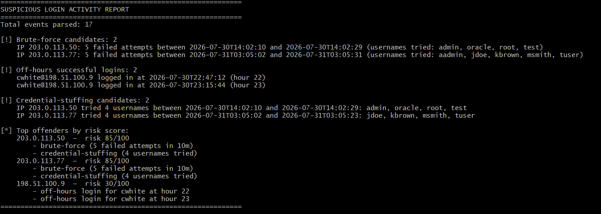

# Suspicious Login Log Analyzer


A Python tool that parses SSH/auth-style logs and flags suspicious
authentication activity — the kind of thing a SOC analyst would triage
by hand, automated.



## What it detects

- **Brute-force attempts** — an IP with 5+ failed logins within a
  10-minute window (both thresholds configurable).
- **Off-hours logins** — successful logins outside business hours
  (6 AM–8 PM), a common indicator of compromised credentials.
- **Credential stuffing** — a single IP attempting 4+ distinct
  usernames in a short window, suggesting automated account discovery
  rather than a person mistyping a password.
- **Risk scoring** — findings are aggregated per IP into a single
  0–100 risk score (weighted: brute-force > credential-stuffing >
  off-hours), so the report surfaces a ranked "top offenders" list
  instead of three disconnected lists.

## CVE lookup (`cve_lookup.py`)

A second, standalone tool that queries the real NVD (National
Vulnerability Database) API for known CVEs affecting a given piece of
software — the natural next step once `analyzer.py` tells you *who* is
attacking, and you want to know *whether the target software is
actually vulnerable*.

```bash
python cve_lookup.py "openssh 7.2"
python cve_lookup.py "apache log4j 2.14" --limit 3 --json
```

No API key required for light use. Includes retry/backoff handling
since the public NVD API rate-limits unauthenticated requests.

## Why I built this

Built as a portfolio project connecting my incident-response coursework
(NIST SP 800-61) to a working tool — the kind of triage I'd want
automated before it ever reaches a human analyst.

## Usage

```bash
# Human-readable report
python analyzer.py sample_auth.log

# JSON output (for piping into other tools / dashboards)
python analyzer.py sample_auth.log --json

# Tune detection sensitivity
python analyzer.py sample_auth.log --threshold 3 --window 5
```

## Example output

```
============================================================
SUSPICIOUS LOGIN ACTIVITY REPORT
============================================================
Total events parsed: 17

[!] Brute-force candidates: 2
    IP 203.0.113.50: 5 failed attempts between 2026-07-30T14:02:10 and 2026-07-30T14:02:29 (usernames tried: admin, oracle, root, test)
    ...
```

## Running tests

```bash
python -m unittest discover -s tests -v
```

## Project structure

```
log-analyzer/
├── analyzer.py           # Core parsing + detection logic + risk scoring + CLI
├── cve_lookup.py          # Standalone NVD API CVE lookup tool
├── sample_auth.log        # Synthetic sample data to run against
├── requirements.txt       # No external dependencies (stdlib only)
├── tests/
│   ├── test_analyzer.py   # Unit tests for detection rules + risk scoring
│   └── test_cve_lookup.py # Unit tests for CVE lookup (mocked, no live network needed)
└── README.md
```

## Possible extensions

- Feed in real auth.log data from a home-lab VM (see `/var/log/auth.log` on Linux).
- Wire `cve_lookup.py` output directly into the risk score — a flagged
  IP attacking a host running vulnerable software should score higher.
- Push findings to a Slack webhook or write them to a SIEM index.
- Add geolocation-based "impossible travel" detection using an IP
  geolocation API.
- Add a `--output report.json` flag to write findings to disk instead
  of only printing to stdout.

## License

MIT
